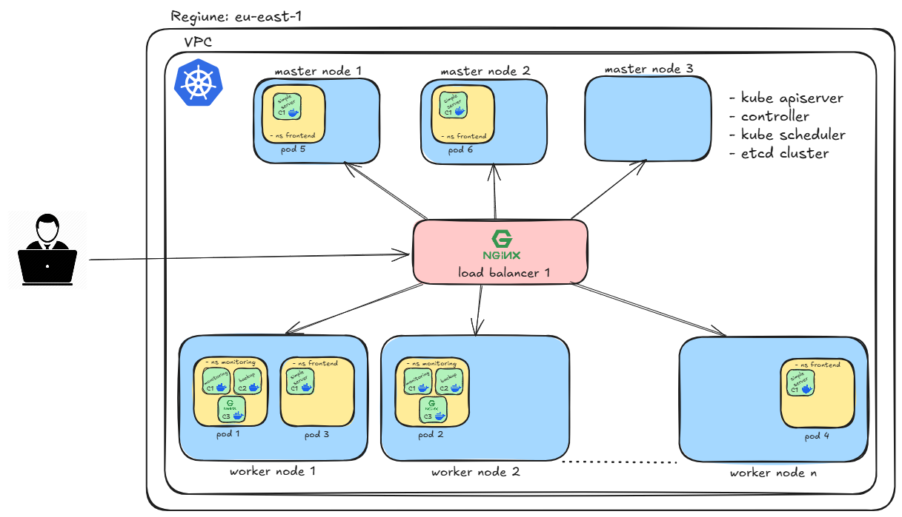
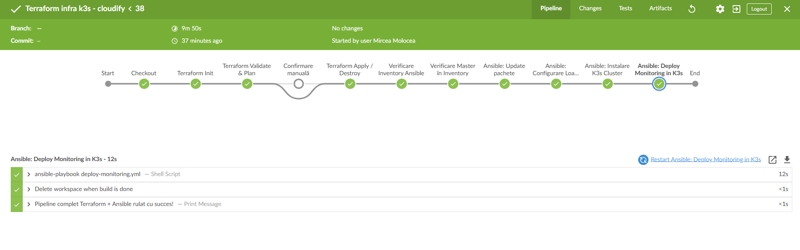

# Platforma de Monitorizare a Stării unui Sistem (Proiect DevOps complet)

---

## Clonare proiect

Pentru a clona acest proiect creați propriul vostru repository EMPTY în GitHub și rulați:

```bash
git clone git@github.com:mirceamrc/platforma-monitorizare.git
cd platforma-monitorizare
git remote -v
git remote remove origin
git remote add origin git@github.com:<USERUL_VOSTRU>/platforma-monitorizare.git
git branch -M main
git push -u origin main
```

---

# Scopul Proiectului

Acest proiect integrează toate etapele unui flux complet **DevOps**, de la monitorizarea sistemului local până la deploy automatizat în **Kubernetes (K3s)**, folosind:

- **Scripturi Bash și Python** pentru monitorizare și backup  
- **Containere Docker** pentru rulare izolată  
- **Kubernetes / K3s** pentru orchestrare  
- **Terraform + OpenStack + AWS S3 backend** pentru infrastructură cloud  
- **Ansible** pentru configurare automată  
- **Jenkins** pentru pipeline-uri CI/CD  
- **NGINX + Certbot** pentru HTTPS și load balancing  
- **HorizontalPodAutoscaler (HPA)** pentru scalare automată în funcție de resurse

---

# Arhitectura Proiectului

Arhitectura finală:

```
Client → HTTPS → lb-1 (NGINX + Certbot) → Cluster K3s (masters + workers) → Pods
```

Roluri:
| Componentă | Rol |
|-------------|-----|
| **lb-1** | Load Balancer extern, NGINX + Certbot |
| **master-1..3** | Control Plane K3s |
| **worker-1..2** | Workload Pods (aplicații, HPA) |
| **jenkins** | Server CI/CD |
| **terraform/ansible** | Management infrastructură |



---

# Structura Proiectului

```
/scripts         – scripturile shell și python pentru monitorizare și backup
/docker          – configurare Docker Compose pentru rulare locală
/k8s             – manifestele Kubernetes (Deployment, Service, HPA)
/terraform       – infrastructură OpenStack și backend AWS S3
/ansible         – playbook-uri pentru K3s, NGINX și deploy aplicații
/jenkins         – pipeline-uri CI/CD pentru build, test, deploy
/imagini         – diagrame, capturi BlueOcean, Jenkins, etc.
```

---

# Setup și Rulare (Local)

## Monitorizare și Backup

Proiectul local rulează două scripturi:

- `system_state.sh` – colectează informații despre CPU, RAM, disk, procese.  
- `backup.py` – face backup periodic la logurile generate, doar dacă fișierul s-a modificat.

### Comenzi utile:
### 1. Rulare script Shell pentru monitorizarea sistemului
```bash
chmod +x system_state.sh
./system_state.sh
```
Acest script va actualiza fișierul `system-state.log` la fiecare `INTERVAL` secunde (implicit 5).

### 2. Rulare script Python pentru backup
```bash
python3 backup.py
```
Scriptul va monitoriza `system-state.log` și va crea backup-uri în directorul `backup/`.

Variabile:
- `INTERVAL=5` – frecvența actualizării logului  
- `BACKUP_INTERVAL=5` – frecvența backup-ului

---

# Rulare în Docker

Serviciile sunt containerizate cu **Docker Compose**:

### Build și rulare:
```bash
cd docker
docker compose up -d --build
```

### Verificare:
```bash
docker compose ps
docker logs monitoring
docker logs backup
```

### Oprire și ștergere containere:
```bash
docker compose down
```

### Verificare containere
```bash
docker compose ps
```

### Verificare loguri servicii
```bash
docker logs monitoring
docker logs backup
```

### Variabile de mediu și configurări

Ambele servicii folosesc variabile de mediu ce pot fi configurate în `compose.yml` sau suprascrise la rulare.

#### Monitoring
- **INTERVAL** (implicit `5`) → perioada în secunde la care se scriu informațiile în `system-state.log`.

#### Backup
- **BACKUP_INTERVAL** (implicit `5`) → perioada la care se verifică dacă trebuie făcut backup.
- **BACKUP_DIR** (implicit `backup`) → directorul unde se salvează copiile fișierului `system-state.log`.

 Suprascriere exemplu:
```bash
docker compose run -e INTERVAL=10 monitoring
```

Volumele partajate (`./shared/`) conțin fișierele `system-state.log` și `backup/`.

---

# Platforma de Monitorizare în Kubernetes (K3s)

Aplicația rulează trei containere:
- `monitoring` – colectează metrice sistem
- `backup` – salvează logurile
- `nginx` – servește logurile și dashboardul HTML

Namespace: `monitoring`

### Comenzi deploy:
```bash
kubectl apply -f deployment.yaml
kubectl get pods -n monitoring
kubectl get svc -n monitoring
```

### Acces aplicație:
`http://<NodeIP>:30080/logs/`

### Autoscaling:
```bash
kubectl get hpa -n monitoring
minikube addons enable metrics-server
```

---

# Infrastructură K3s pe OpenStack (Terraform)

Terraform creează infrastructura completă: 1 Load Balancer, 3 Mastere, 2 Workeri.

### Configurare OpenStack - cloudify.ro:
1. Intră în cloudify.ro → **API Access** → „Creează Application Credential”.
   - Nume: `Un nume pentru credentiale`
   - Descriere: `O descriere pentru credentiale`
   - Salvează credentialele sau apasă "Descarcă fișier-ul openrc":
     ```bash
     OS_APPLICATION_CREDENTIAL_ID=<CREDENTIAL ID>
     OS_APPLICATION_CREDENTIAL_SECRET=<CREDENTIAL SECRET>
     ```
2. Instaleaza Openstack CLI (python-openstackclient)
```bash
pip3 install python-openstackclient
```

3. Incarca credentialele Openstack descarcate din cont
```bash
source my-credentials.openrc
```

4. Verificare conexiune
```bash
openstack server list
openstack image list
openstack network list
```

5. Configurează Terraform:

```hcl
provider "openstack" {}
```

### Backend AWS S3:
1. Intră în AWS → **S3** → „Create Bucket”.
   - Nume bucket: `itschool-s3`
   - Region: `eu-north-1`
   - Activează „Block all public access”

2. Creează o **cheie de acces** pentru Terraform:
   - Click pe nume utilizator -> Security credentials
   - La rubrica *Access keys* apasati pe *create access key*
   - Salvează cheile:
     ```bash
     AWS_ACCESS_KEY_ID=<Access key>
     AWS_SECRET_ACCESS_KEY=<Secret access key>
     ```

3. Configurează Terraform:

Backend-ul este utilizat pentru **stocarea fișierului de stare Terraform (`terraform.tfstate`)** într-un bucket S3, permițând:
- lucrul colaborativ din mai multe locații;
- sincronizarea automată a modificărilor infrastructurii;
- protejarea stării în cloud, în loc de fișiere locale.
```hcl
terraform {
  backend "s3" {
    bucket  = "itschool-s3"
    key     = "terraform.tfstate"
    region  = "eu-north-1"
    encrypt = true
  }
}
```

### Flux complet de lucru: 

#### Inițializare
În directorul `terraform/` rulează:
```bash
terraform init
```

#### Creare infrastructură
```bash
terraform apply
```

Terraform va:
- crea rețeaua, cheile și security group-urile;
- porni toate mașinile virtuale;
- genera fișierul `../ansible/inventory.ini` automat, cu IP-urile reale.

#### Integrare cu Ansible

După generare:
```bash
cd ../ansible
ansible-playbook -i inventory.ini <nume>.yml
```

Ansible va instala automat:
- Docker (doar pe master & worker),
- K3s în mod HA,
- NGINX pe load balancer.

#### Ștergerea completă a infrastructurii

Pentru a distruge toate resursele create:
```bash
terraform destroy
```

---

# Automatizare infrastructură K3s cu Ansible

Ansible configurează automat:
- update OS,
- instalare NGINX + Certbot pe load balancer,
- cluster K3s HA complet.

### Playbook-uri:

```bash
ansible-playbook update.yml
ansible-playbook config-lb.yml
ansible-playbook cluster-k3s.yml
```

`inventory.ini` este generat automat din Terraform.

### Etape principale:
1. **Instalare Docker** pe toate nodurile master/worker.  
2. **Instalare K3s pe primul master** (`--cluster-init`).  
3. **Copiere automată `node-token`** pentru autentificare.  
4. **Adăugare masteri secundari** conectați la load balancer.  
5. **Adăugare workeri în cluster** folosind token-ul.  
6. **Verificare finală a nodurilor din cluster**.

### Verificare manuală:
Pe `master-1`:
```bash
kubectl get nodes -o wide
```

---

# Deploy aplicație de monitorizare în K3s

Acest playbook **`deploy-monitoring.yml`** automatizează procesul de **deploy al aplicației de monitorizare** în clusterul **K3s**.  
Scopul lui este să copieze manifestul Kubernetes pe master-ul principal, să-l aplice și să verifice dacă toate resursele din namespace-ul `monitoring` rulează corect.

### Cum se rulează playbook-ul

După ce clusterul K3s este complet funcțional (instalat prin `cluster-k3s.yml`), rulează:

```bash
ansible-playbook deploy-monitoring.yml
```

Acesta va:
1. Copia fișierul `deployment.yaml` din directorul `k8s/` pe serverul `master-1`;
2. Aplica manifestul Kubernetes în cluster;
3. Aștepta ca namespace-ul `monitoring` să fie creat;
4. Verifica și afișează starea podurilor și a serviciilor.

### Verificare manuală:

După rulare, poți verifica manual din linia de comandă pe master:

```bash
kubectl get pods -n monitoring -o wide
```

Dacă toate podurile au status `Running`, deploy-ul a fost efectuat cu succes.

```bash
kubectl get svc -n monitoring
```

Rezultat:
```
monitoring-service   NodePort   10.43.117.165   <none>   80:30080/TCP   15s
```

---

# Deploy aplicația `simple-server` cu NGINX și HPA

Playbook: `deploy-simple-server.yml`  
Manifest: `simple-server-deployment.yaml`

- Namespace: `frontend`
- Port container: `8123`
- NodePort extern: `30081`
- Domeniu: `https://app.itschool.live`
- Scalare automată: `min=4`, `max=15`

### Comenda pentru deploy:
```bash
kubectl apply -f simple-server-deployment.yaml
```

### Observarea autoscalării (HPA)

Verifică statusul HPA:
```bash
kubectl get hpa -n frontend
```

Monitorizează în timp real:
```bash
watch kubectl get pods -o wide -n frontend
watch kubectl get hpa -n frontend
```

Exemplu de rezultat:
```
NAME                REFERENCE                             TARGETS                        MINPODS   MAXPODS   REPLICAS   AGE
simple-server-hpa   Deployment/simple-server-deployment   cpu: 1%/60%, memory: 35%/75%   4         15        13         37m
```

### Simularea traficului pentru scalare automată

Rulează următoarea comandă de mai multe ori pentru a genera încărcare CPU în aplicație:

```bash
curl https://app.itschool.live/?burn=60 &
```

sau în buclă:
```bash
for i in {1..30}; do curl https://app.itschool.live/?burn=60 & done
```

După câteva secunde, numărul de poduri va crește automat în funcție de încărcare.

### Curățarea completă a aplicației

Pentru a șterge complet aplicația `simple-server`:
```bash
kubectl delete namespace frontend
```

---

# CI/CD – Jenkins Pipelines

## Structura
```
jenkins/
└── pipelines/
    ├── backup/           → CI/CD pentru aplicația Python (backup.py)
    │   └── Jenkinsfile
    ├── monitoring/       → CI/CD pentru scriptul de monitorizare (monitoring.sh)
    │   └── Jenkinsfile
    └── terraform/        → Pipeline complet pentru infrastructură Terraform + Ansible
        └── Jenkinsfile
```

Pipeline Terraform + Ansible:
1. Terraform init + apply
2. Confirmare manuală „Apply/Destroy”
3. Ansible deploy cluster + NGINX
4. Cleanup automat workspace



## Pipeline – Backup (Python)

**Fișier:** `jenkins/pipelines/backup/Jenkinsfile`

### Etape:
1. **Lint:** verifică sintaxa Python cu `flake8`
2. **Test:** rulează teste rapide (`pytest` sau verificare basic de execuție)
3. **Build Docker Image:** construiește imaginea `docker-backup`
4. **Push Docker Hub:** publică imaginea în contul Docker Hub
5. **Clean Workspace:** curăță workspace-ul Jenkins după rulare

### Variabile necesare în Jenkins:
| Variabilă | Tip | Descriere |
|------------|------|-----------|
| `DOCKERHUB_CREDENTIALS_ID` | Credential | ID-ul credentialului Docker Hub (username + password) |


## Pipeline – Monitoring (Bash)

**Fișier:** `jenkins/pipelines/monitoring/Jenkinsfile`

### Etape:
1. **Build Docker Image:** creează imaginea pentru scriptul `monitoring.sh`
2. **Push Docker Hub:** publică imaginea `docker-monitoring`
3. **Deploy:** rulează comanda `docker run` sau `kubectl apply` (în funcție de setup)
4. **Post Cleanup:** șterge workspace-ul

### Variabile necesare în Jenkins:
| Variabilă | Tip | Descriere |
|------------|------|-----------|
| `DOCKERHUB_CREDENTIALS_ID` | Credential | ID-ul credentialului Docker Hub |


## Pipeline – Terraform + Ansible (OpenStack / AWS S3)

**Fișier:** `jenkins/pipelines/terraform/Jenkinsfile`

### Etape principale:
1. **Setare Environment:**
   - Injectează variabilele OpenStack și AWS în `env`
   - Configurare automată `OS_AUTH_*` și `AWS_ACCESS_KEY_*`
2. **Terraform Init & Plan**
   - Inițializează backend-ul `S3`
   - Creează planul de infrastructură (`tfplan`)
3. **Confirmare manuală**
   - Oprește execuția și cere confirmare („Apply sau Destroy?”)
4. **Terraform Apply / Destroy**
   - Creează infrastructura completă K3s
5. **Verificare inventory**
   - Așteaptă până serverele sunt online (`ansible all -m ping`)
6. **Ansible Playbooks**
   - Rulează:
     - `update.yml` → actualizare pachete
     - `config-lb.yml` → configurare Load Balancer (NGINX + Certbot)
     - `cluster-k3s.yml` → instalare cluster K3s

## Crearea unui view dedicat în Jenkins

Recomandare:
Creează un **View** nou în Jenkins (ex: `Deploy DockerHub`) și adaugă doar aceste joburi:
- `DockerHub - backup`
- `DockerHub - monitoring`

 Tip view: `List View` 

## Utilizatori și permisiuni

Creează un user dedicat:
- Nume: `itschool`
- Rol: `DeployDocker`
- Pattern: `DockerHub.*`
- Permisiuni:  
  - `Job Read`, `Job Build`, `Job Configure`
  - Acces doar la view-ul `Deploy DockerHub`

## Execuție automată la commit (GitHub Webhook)

Fiecare Jenkinsfile este configurat să ruleze automat la:
- **push pe branch-ul `main`**
- **PR-uri (pull requests)**

Asigură-te că webhook-ul GitHub trimite evenimentul `push` către:
```
https://jenkins.xxxxxx.ro/github-webhook/
```

---

# Depanare și Investigare Erori

### Verificare loguri Kubernetes:
```bash
kubectl logs -n frontend <nume-pod>
kubectl describe pod -n frontend <nume-pod>
```

### Verificare loguri NGINX:
```bash
tail -f /var/log/nginx/access.log
tail -f /var/log/nginx/error.log
```

### Verificare metrici HPA:
```bash
kubectl top pods -n frontend
kubectl top nodes
```

---

# Resurse utile

- [Markdown Syntax](https://www.markdownguide.org/cheat-sheet/)
- [Documentație Kubernetes](https://kubernetes.io/docs/home/)
- [Documentație Ansible](https://docs.ansible.com/)
- [Certbot NGINX](https://certbot.eff.org/instructions)
- [Schelet proiect ITSCHOOL](https://github.com/amihai/platforma-monitorizare)

---

## Concluzie finală

✔️ Soluție completă DevOps – de la scripturi locale la orchestrare în Kubernetes  
✔️ Infrastructură automatizată Terraform + OpenStack + Ansible  
✔️ Pipeline CI/CD cu Jenkins  
✔️ HTTPS și load balancing cu NGINX + Certbot  
✔️ Scalare automată cu HPA și metrics-server  
✔️ Configurație ușor extensibilă pentru aplicații noi
